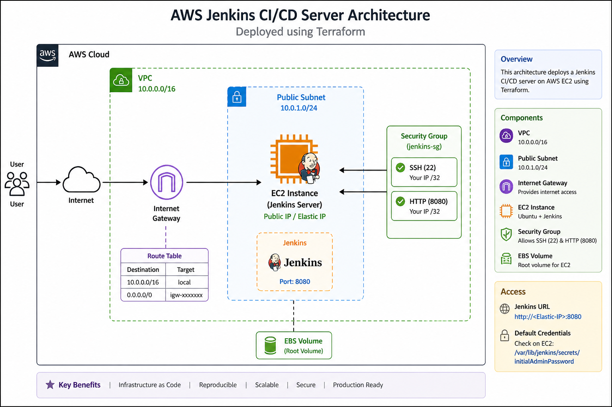

# AWS DevOps CI/CD Pipeline with Terraform and Jenkins

## Overview

This project demonstrates the design, provisioning, & operation of a CI/CD platform on AWS using Terraform and Jenkins.

It focuses not only on infrastructure deployment, but also on handling real-world issues such as service failures, dependency mismatches, and system-level debugging. The implementation reflects practical DevOps workflows where infrastructure and application layers must both be validated.

---

## Architecture



The solution includes:

* Custom VPC with public subnet
* Internet Gateway for external connectivity
* Security Groups for controlled access (SSH and Jenkins)
* EC2 instance running Jenkins
* Elastic IP for consistent public access
* Automated Jenkins installation using a bootstrap script

---

## Technology Stack

* Cloud Provider: AWS
* Infrastructure as Code: Terraform
* CI/CD Platform: Jenkins
* Operating System: Ubuntu (EC2 t3.micro - free tier eligible)
* Scripting: Bash
* Version Control: Git and GitHub

---

## Key Features

* Modular Terraform architecture for reusability and scalability
* Automated provisioning and configuration of Jenkins
* Secure and structured cloud networking
* Elastic IP for stable endpoint access
* End-to-end troubleshooting of infrastructure and application issues

---

## Project Structure

```
terraform-jenkins-aws/
│
├── modules/
│   ├── vpc/
│   ├── ec2/
│   └── security_groups/
│
├── environments/
│   └── dev/
│
├── scripts/
│   └── install_jenkins.sh
│
├── diagrams/
│   └── architecture.png
│
└── README.md
```

---

## Deployment

Clone the repository:

```bash
git clone https://github.com/YOUR_USERNAME/terraform-jenkins-aws.git
cd terraform-jenkins-aws/environments/dev
```

Initialize Terraform:

```bash
terraform init
```

Review the execution plan:

```bash
terraform plan
```

Apply the infrastructure:

```bash
terraform apply
```

---

## Accessing Jenkins

Once deployment is complete:

```
http://<EC2_PUBLIC_IP>:8080
```

---

## Retrieving the Initial Admin Password

Connect to the instance:

```bash
ssh -i <your-key.pem> ubuntu@<EC2_PUBLIC_IP>
```

Retrieve the password:

```bash
sudo cat /var/lib/jenkins/secrets/initialAdminPassword
```

---

## Operational Challenges and Resolutions

### Jenkins service failed to start

* Cause: Installed Java version (17) did not meet Jenkins runtime requirement
* Resolution: Upgraded to Java 21 and configured system alternatives

### Package installation failure

* Cause: Repository GPG key and signing issues
* Resolution: Reconfigured Jenkins repository using secure keyring method

### EC2 provisioning errors

* Cause: Invalid AMI and instance type constraints
* Resolution: Implemented dynamic AMI selection and used free-tier compatible instance

### Service startup instability

* Cause: systemd execution failures during initialization
* Resolution: Diagnosed using journal logs and resolved dependency issues

---

## Security Considerations

* SSH access restricted using CIDR-based rules
* Limited exposure to required ports only (22 and 8080)
* Sensitive files excluded from version control using `.gitignore`
* Principle of least privilege applied to network access

---

## Key Learnings

* Successful infrastructure provisioning does not guarantee application availability
* Debugging and log analysis are core DevOps responsibilities
* Version compatibility is critical for platform stability
* Modular infrastructure design improves maintainability and reuse

---

## Future Enhancements

* Integrate GitHub Actions for automated Terraform deployment
* Configure remote backend using S3 and DynamoDB
* Containerize Jenkins for improved portability
* Implement HTTPS using reverse proxy and SSL
* Add monitoring and alerting (CloudWatch or Prometheus)

---

## Author

Moses Abiona
DevOps Engineer | Cloud Infrastructure | CI/CD

---

## Project Significance

This project demonstrates the ability to:

* Design and provision cloud infrastructure using Infrastructure as Code
* Deploy and operate a CI/CD platform in a cloud environment
* Diagnose and resolve real-world system and deployment issues
* Apply DevOps principles in a practical and production-oriented context

---
